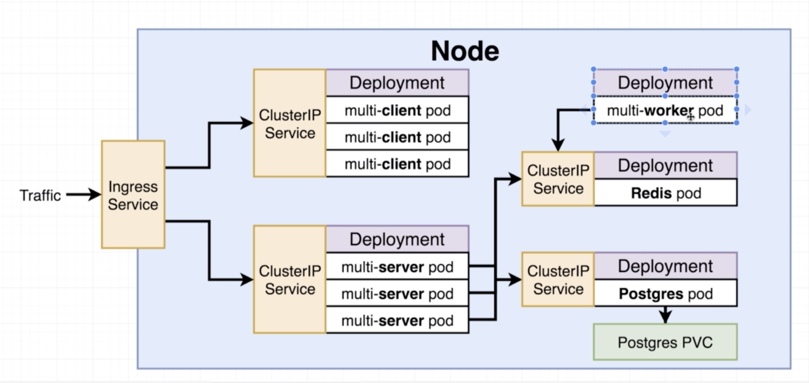
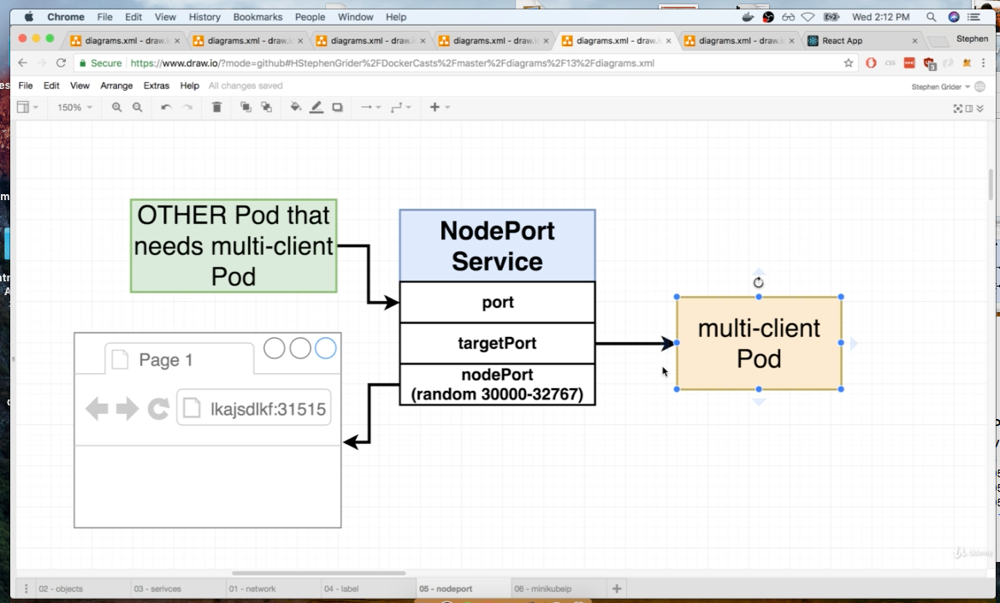
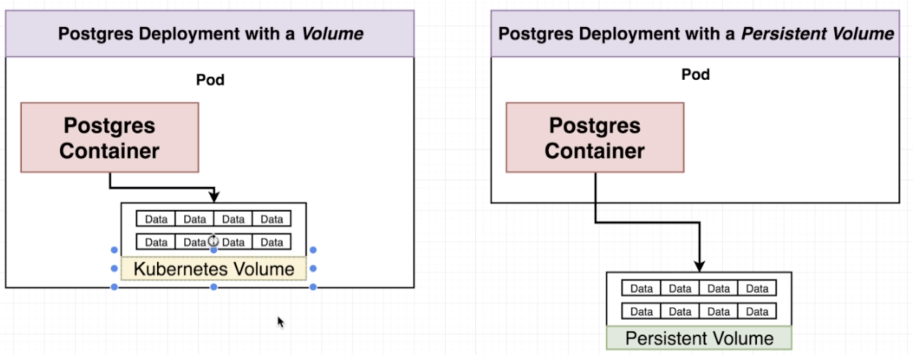

kubernetes commands and notes
Kubernetes Node VM created by minikube

kube-proxy -> service NodePort -> pods
because of the proxy the nodeport address is not directly accessble by the local machine

A config.ml file (file which contains info such as pods congif, services config etc) allows u to change only the image name, image prop
use deployments instead to create pods

pods: group containers doing similar tasks or containers which need to run alongside each other
cluster: group of pods
nodes: group of clusters
Services: Takes care of the networking 

Deployment: Runs a set of identical servers 
- Good for dev and productions
- Create deploymnets which creates pods instead of creating pods directly
- add the clusterip yaml file for networking

types of "kind" used in config files:
- statefulset
- replicaController
- pod: pods group containers doing similar tasks or containers which need to run alongside each other
- service: setup networking in the cluster

## types of services: kind="service"

- clusterIP: Allow in-cluster networking services. It allows multiple pods to communicate with eachother. Outside traffic cannot access these ports directly. 
- NodePort: exposes to specified port to the outside world (Only for dev stage)
- LoadBalancer: (legacy ingres is the new way)
- ingress: production stage better type of load balencer

when listing deployments with kubectl get deployments
Desired: the number of pod whech are running the latest versionof the <deployment.yml>file
Current: The total number of pods running including the old and desired it can be greater than the "desired" coloumn value

The ingress being used ingress-nginx

## Ports in a service.yml file

- port: <Port> #port which another pod or container can access; other pods ---> current pod
- targetPort: <Target Port> #containers port exposed as given in docker file. must be equal to the containerPort in kind:"Pod" configfile, sends any incoming trafic to <TargetPort>; current pod ---> other pod or outside world
- nodePort: <port number> #Access by enduser select port between 3000-32767 if not specified it will be randomly generated used only in dev
*nodeport not needed if using clusterip*

## Volumes 

### Volumes are of 3 types:
- Kubernetes volume
- persistant Volume
- Persistant volume claim

* Use volumes to protect db data from sudden loss in data or crashes
* Volumes can help kubernetes to startup a new pod with the existing data when the old container is lost
* if the replicas value is more than 1 then make sure each of the pod speak with eachother. Mulitple DB pods which dont talk to each other is a not recomended
* Use something like persistant volume claim to setup volumes for DBs

### Volumes are apart of the pod
- if a container in a pod dies in a new container can be created and share the data from the previous volume.
- if the pod dies then data is lost

### Persistant volume vs Kubernetes volume

- persistant volumes are not tied with any pods unlike Kubernetes volumes
- therefore if the pod crashes the new pod can share data from the old persistant volume created unlike the Kubernetes volumes

### Difference between Persisant volume claim persistante volume 
- are like advertisments which show the types of storage options available/needs 
- The amount of data being advertised can be either already present and ready to be used or be provisioned on the fly.
- the amount of data store needed must be added to the config file 
- kubernetes clusters has a couple of already provisioned data store options these are called staically provisioned persistant volumes. The cluster then check the congif file and wil provision the amount of storage option 
- if the data storage amount specified was not statically created then a the asked amount is created on the fly and provisioned this is called Dynamically provisioned

Acess mode:
Types: 
- ReadWriteOnce: Can be used by a single pod at a type
- ReadOnlyMany: Multiple nodes can read many times
- ReadWriteMany: Multiple nodes can read and write many times

### Steps to Ingress:
- Ingress config
- Ingress controller: impliments the ingress with the help of the coonfig file
- Accepts traffic and sends it to the appropriate service

- HEML is used to administor 3rd party software in our kubernetes cluster. Used  - - - - install additional services 
- tiller is the serverused to serve the application
- heml cli - client
- tiller - server
- helm files
    - Chart.yml - stores metadata about application. and version
    - values.yml - stores default configuration
    - requriments.yml - stores the dependencies
    - charts/ (dir)- pakages are stores
    - templates/ (dir)- where source templates are stores and are fed into the heml - templating engine 
    - _helpers - stores functions 
